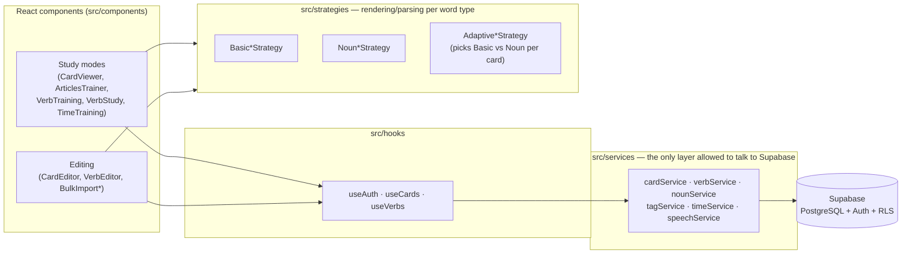

# Cards — German Vocabulary Trainer

[](https://github.com/strakhovdenya/cards/actions/workflows/ci.yml)

A mobile-first web app for learning German vocabulary, articles, verb conjugations and telling
time — with a public, read-only demo that needs no sign-up.

**Live demo:** https://cards-indol-eight.vercel.app/demo

---

## Part 1 — Overview for recruiters / hiring managers

Cards is a personal portfolio project built to demonstrate production-style full-stack
TypeScript engineering: a real Next.js/React/Supabase application, live in production, with the
process discipline (CI, RLS-based data isolation, ADRs, issue-first workflow) that a professional
codebase is expected to carry — not just a working prototype.

It is a real product I use myself to learn German, currently covering flashcard vocabulary,
noun articles, verb conjugation and telling the time, and it has real users beyond myself
(invite-only signup, see [Auth & access control](#auth--access-control)).

**Production practices applied in this repo** (not just a happy-path prototype):

- **CI on every push/PR** (`main`): lint (zero warnings), Prettier formatting, TypeScript
  type-check, Vitest unit tests, and a production build — see [CI](#ci).
- **Row-level security (RLS) in Supabase** is the only thing separating one user's data from
  another's — every schema/RLS change is applied manually by a human against the live database,
  never automated (see [ADR-002](./project-management/DECISIONS.md#adr-002--изменения-схемы-supabase-применяет-только-человек-и-только-аддитивно)).
- **Rate limiting** on public guest endpoints and `/auth/**`: a shared sliding-window limiter
  backed by Upstash Redis, with an automatic in-memory fallback if Redis is unreachable (see
  [ADR-005](./project-management/DECISIONS.md#adr-005--rate-limiting-upstash-redis-с-in-memory-деградацией)).
- **Public read-only demo mode** (`/demo`) — a real, unauthenticated visitor sees live data
  through a guest account with every mutation (create/edit/delete/mark-as-learned) disabled at the
  UI layer, not just hidden.
- **Traceable task planning:** every change ships from a written GitHub Issue (context, affected
  files, invariants, acceptance criteria, test requirements) on a dedicated branch, through a PR
  reviewed against a live Vercel preview before merge — see [Development workflow](#development-workflow).
- **Architecture Decision Records:** every non-obvious or previously-reverted decision (styling
  system, rate-limiting design, DB-migration policy, Ralph's git/gh permission boundary) is written
  down once in [`project-management/DECISIONS.md`](./project-management/DECISIONS.md) instead of
  being re-litigated in every new conversation.
- **Autonomous execution for well-scoped tasks:** a self-built "Ralph loop" controller
  (adapted from my other portfolio project, [jobflow-cv-pipeline](https://github.com/strakhovdenya/jobflow-cv-pipeline))
  can drive a clearly-specified GitHub Issue from this repo's own tracker to an open PR without a
  human confirming each step — the coding agent only ever edits files and runs `npm run *`; every
  `git`/`gh` mutation is owned by a deterministic controller script, and DB-schema changes are
  refused outright (`BLOCKED-DB-CHANGE`) because they need a human against the live database. See
  [Autonomous task execution: the Ralph loop](#autonomous-task-execution-the-ralph-loop).

### Project status

| Area | Status | Notes |
|------|--------|-------|
| Flashcard study mode | Implemented | Adaptive rendering per word type (regular word vs. noun with article/plural) — see [Study modes](#study-modes). |
| Articles trainer (der/die/das) | Implemented | Multiple-choice drill over the noun deck, with running correct/error counters. |
| Verb conjugation training | Implemented | Random verb + random grammatical person, self-graded. |
| Verb infinitive study | Implemented | Flashcard-style infinitive ↔ translation review with text-to-speech. |
| Telling-time mini-quiz | Implemented | Assemble the German time expression from word chips; formal and informal register modes. |
| Card / verb editing & bulk import | Implemented | Manual CRUD plus paste-and-parse bulk import (see [Editing & content management](#editing--content-management)). |
| Tagging | Implemented | Tag-based filtering across every study mode; tag CRUD via a dedicated manager. |
| Auth & invite-only signup | Implemented | Supabase Auth; first account becomes admin, everyone after needs an admin-issued, expiring invite code. |
| Public read-only demo | Implemented | `/demo` — no login, mutations disabled at the UI layer. |
| Rate limiting | Implemented | Upstash Redis sliding window, in-memory fallback. |
| CI/CD | Implemented | GitHub Actions: check, test, build on every push/PR; Vercel auto-deploys `main`. |
| Automated dependency/code scanning | Not yet | Would be the next hardening step if this repo grew a real user base beyond a personal project. |
| E2E tests | Implemented, manual only | Playwright against `/demo`, run locally (not wired into CI yet — needs secrets in GitHub Actions). |

---

## Part 2 — Technical overview

### Stack

- **Next.js 16** (App Router, Turbopack) · **React 19** · **TypeScript** (strict)
- **MUI 7** — the sole UI/styling system (`sx`, `styled`, one theme); no Tailwind, no separate CSS
- **Supabase** — PostgreSQL + Auth, with row-level security as the sole data-isolation boundary
- **Upstash Redis** (`@upstash/ratelimit`) — shared rate-limit store, with in-memory fallback
- **Vitest** — unit tests for `utils/`, `strategies/`, `services/`
- **Playwright** — manual, local-only E2E against `/demo`

### Architecture



**Why a strategy pattern for cards, not a type-check in the component.** A "card" can be a plain
vocabulary word or a German noun (which additionally carries an article and a plural form and
needs different quiz/display logic). `AdaptiveCardStrategy` picks between `BasicCardStrategy` and
`NounCardStrategy` per card at render time, so `CardViewer`/`CardEditor`/`BulkImport` stay ignorant
of word-type branching — adding a third word type means adding a third strategy, not another `if`
inside every consumer. The same pattern is mirrored for bulk-import parsing
(`BasicBulkImportStrategy` / `NounBulkImportStrategy`) and the card editor form
(`BasicCardEditorStrategy` / `NounCardEditorStrategy`).

**Why all data access lives in `src/services`.** Components and routes never call Supabase
directly — every read/write goes through a service (`cardService`, `verbService`, `nounService`,
`tagService`, `timeService`) or the hooks that wrap them (`useAuth`, `useCards`, `useVerbs`). This
is the boundary that keeps demo-mode read-only enforcement and RLS assumptions in one place instead
of scattered across components.

### Study modes

Each study mode is a self-contained component with its own interaction model — there is no shared
"quiz engine" underneath them, by design: the four modes are different enough (flip-card review vs.
multiple-choice vs. sentence assembly) that a shared abstraction would mostly be branching.

- **Flashcards** (`UniversalCardViewer` + `CardViewer`) — the core review loop. A two-sided card
  flips between German and Russian (either side can be the front, toggled per session), with
  keyboard shortcuts (`←`/`→` navigate, `Space` flip, `S` shuffle, `Enter` mark learned, `F` swap
  front side), tag-based filtering, per-card text-to-speech, and a persisted "learned" flag per
  card (disabled in demo mode). Card content itself is produced by `AdaptiveCardStrategy`, so a
  noun card shows its article and plural alongside the base word without `CardViewer` knowing
  nouns exist as a special case.
- **Articles trainer** (`ArticlesTrainer`) — a multiple-choice drill for German noun articles
  (*der/die/das*): the noun's base form is shown, the learner picks an article, and the choice
  animates toward a running correct/error counter. Word order is reshuffled whenever the tag
  filter changes; wrong answers don't remove the word from rotation.
- **Verb conjugation training** (`VerbTraining`) — picks a random verb and a random grammatical
  person, lets the learner recall the conjugated form mentally, then reveals the answer for
  self-grading ("correct"/"incorrect"), tracking a running accuracy count for the session.
- **Verb infinitive study** (`VerbStudy`) — a flashcard-style review of verb infinitives and their
  translations (not conjugations), with text-to-speech and the same shuffle/keyboard-navigation
  pattern as the main flashcard viewer.
- **Telling-time mini-quiz** (`TimeTraining`) — a generated time is shown and the learner assembles
  the correct German phrase by tapping word chips in order, in either *formal* (`Es ist ...`) or
  *informal* register; self-graded against the generated answer, with a running session score.

### Editing & content management

- **Manual CRUD** (`CardEditor`, `VerbEditor`) — add, edit and delete individual cards/verbs, with
  the noun-specific fields (article, plural) shown only for noun cards via the editor-strategy
  pair described above.
- **Bulk import** (`BulkImport`, `BulkVerbImport`, `BulkNounImport`) — paste a text block of
  `German word - translation` lines and get back parsed cards, duplicate-detection against the
  existing deck, and per-line error reporting (missing separator, empty word/translation). The
  noun variant additionally extracts the article and plural from the pasted German form. Each
  bulk-import strategy also exposes a ready-to-copy prompt template (`getGptPrompt()`) for
  generating a compatible word list with an LLM, and a short in-UI format example
  (`getFormatExample()`).
- **Tags** (`TagManager`, `TagFilter`) — create/rename/delete tags and filter every study mode by
  one or more tags at once.

### Auth & access control

- Supabase Auth email/password sign-up and sign-in, with password reset.
- **First account becomes admin** (`checkIfAdminsExist()`); every account created after that
  requires an admin-issued invite code with an expiry timestamp, optionally locked to a specific
  email address. Admins manage invites through `InviteManager`.
- **Demo mode is read-only at the UI layer, not just by convention:** every mutation control
  (add/edit/delete, mark-as-learned, tag management) is disabled for the guest session serving
  `/demo`, on top of whatever Supabase RLS already restricts for that account.

### Security & reliability

- **RLS is the only data-isolation boundary** between users — application code never filters by
  `user_id` as a substitute for a Supabase policy.
- **Rate limiting** (`src/lib/rate-limit.ts`, enforced in `src/proxy.ts`) — 60 req/min on public
  guest API endpoints, 20 req/5 min on `/auth/**`, sliding window via Upstash Redis shared across
  all Edge instances; falls back to a per-instance in-memory limiter if Redis is unavailable, with
  a `Retry-After` header on `429`.
- **Server secrets are never required at build time** — the Supabase service-role client is
  created lazily on first use, so CI and Vercel Preview builds succeed without production secrets
  (`ADR-003`); production-only server routes fail at request time on Preview instead, a deliberate
  trade-off over exposing a service-role key to a public preview URL.

### Autonomous task execution: the Ralph loop

`.claude/ralph/` is a locally-run controller, adapted from my other portfolio project
([jobflow-cv-pipeline](https://github.com/strakhovdenya/jobflow-cv-pipeline)), that can take a
well-scoped GitHub Issue from this repo's tracker to an open PR without a human confirming every
step — reserved for simple, unambiguous tasks with a clear Acceptance Criteria list.

- **The coding agent never touches `git`/`gh`.** It edits files and runs `npm run *` in a fresh
  clone, then replies with exactly one of `DONE`, `BLOCKED: <reason>` or
  `BLOCKED-DB-CHANGE: <reason>`. Every mutation — clone, commit, push, PR creation, issue
  comments/labels — is owned by a deterministic controller script (`core.js`/`github.js`).
- **`BLOCKED-DB-CHANGE` instead of a generic block.** Supabase is one project shared by production
  and every Preview deploy, so a breaking migration takes down the live app before its PR is even
  merged. Schema/SQL changes (`docs/**`) are closed to the agent by permission `deny` rules, and
  any issue that needs one is refused outright rather than attempted.
- **A post-`DONE` self-review, then an independent code-review pass**, before anything is
  committed — an agent claiming success doesn't mean the diff actually satisfies the issue's own
  Acceptance Criteria or Key Invariants; both checks read the issue text again against the real
  diff, with no shared memory with the implementer.
- **A final `npm run check`/`npm run build` gate the controller runs itself**, trusting neither the
  implementer's self-report nor the review passes' verdict that "the build is red but that's
  expected" — a red build here is `BLOCKED`, no PR gets created.
- **Subagents (`.claude/agents/`) run on a cheaper model for work that doesn't need the main
  one** — searching the codebase (`codebase-scan`), investigating unfamiliar code before a change
  (`research`), running the `check`/`build`/`test` gate (`verify`), and drafting a commit/PR
  description from the diff (`pr-writer`). The main implementer stays focused on the files it's
  actually editing and only reads back a short summary from each.
- Full design rationale, every live-run incident that shaped a safeguard, and the exact
  verification chain live in [`.claude/ralph/README.md`](./.claude/ralph/README.md).

### Development workflow

`/prd` → `/plan` → `/issues` for a multi-phase feature; a single task skips straight to a GitHub
Issue in the same body format (Context, Affects, Key Invariants, Acceptance Criteria, Test
Requirement, Definition of Done — the same format Ralph parses for autonomous runs). Every change
follows: **issue → branch (`task/ISSUE-<n>-...`) → PR (`Closes #<n>`) → human review of the Vercel
preview → merge.** Direct commits to `main` are not used. Decisions worth not re-litigating are
written once in [`project-management/DECISIONS.md`](./project-management/DECISIONS.md).

### Running locally

1. Copy environment variables and fill in the values:
   ```bash
   cp .env.example .env.local
   ```
   See `.env.example` — each variable is annotated with where to find it (Supabase dashboard,
   Upstash dashboard). Upstash variables are optional; without them the in-memory fallback is used.

2. Start the dev server:
   ```bash
   npm run dev
   ```

3. Open [http://localhost:3000/demo](http://localhost:3000/demo) for guest mode, or sign up at
   `/auth/signup` for a full authenticated account.

### Commands

```bash
npm run dev           # Next.js dev server (Turbopack)
npm run check         # lint:strict + prettier check + tsc --noEmit  ← pre-commit gate
npm run fix           # auto-fix lint and formatting
npm run build         # production build — same as what Vercel deploys
npm run test          # Vitest unit tests
npm run test:coverage # coverage report
npm run test:e2e      # Playwright E2E against /demo — manual, local only (see CLAUDE.md)
```

### CI

GitHub Actions runs three jobs on every push and PR against `main`:

| Job | What it does |
|-----|-------------|
| Check | `npm run check` — ESLint (zero warnings), Prettier, TypeScript |
| Test | `npm run test` — Vitest unit tests |
| Build | `npm run build` — production build without server-side secrets (see `ADR-003` in `CLAUDE.md`) |

**Unit test coverage (Vitest):** `src/utils/`, `src/strategies/` (all 9 files), and
`src/services/` (card, tag, noun, verb, time services via mocks). `speechService.ts` and
`migrateData.ts` are out of scope (DOM-dependent / private-only logic respectively).

### Further reading

- [CLAUDE.md](./CLAUDE.md) — full architectural rules, layer conventions, and development workflow
- [docs/README.md](./docs/README.md) — database schema, RLS policies, and Supabase migration notes
- [project-management/DECISIONS.md](./project-management/DECISIONS.md) — key architectural decisions (ADRs)
- [.claude/ralph/README.md](./.claude/ralph/README.md) — the Ralph loop's full design rationale
